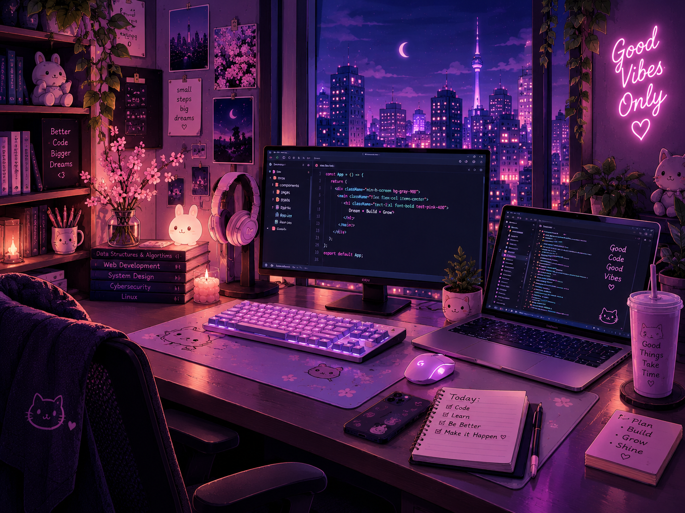

<!-- =========================
     🌸 GITHUB PROFILE README
========================= -->

<!-- 🌸 BANNER -->

  

 

<!-- =========================
     👋 INTRO
========================= -->

<h1 align="center">
  🌸 Hi, I'm Pooja Gupta 👋
</h1>

  <strong>Computer Science Student • Developer • Dreamer</strong>

  💻 Building • 🎨 Creating • 🌱 Learning

  <i>Turning ideas into code, one project at a time ✨</i>

 

<!-- =========================
     🌷 ABOUT ME
========================= -->

<h2 align="center">
  🌷 About Me
</h2>

  

 

  <strong>Hey! I'm Pooja 👋</strong>

  I'm a <strong>Computer Science student</strong> and aspiring
  <strong>software developer</strong> who loves building things,
  solving problems, and bringing creative ideas to life through code.

 

<!-- WHAT I ENJOY -->

<h3 align="center">
  💫 What I Enjoy
</h3>

  💻 <strong>Full-Stack Development</strong>
  &nbsp; • &nbsp;
  🧠 <strong>Problem Solving</strong>

  🔐 <strong>Cybersecurity</strong>
  &nbsp; • &nbsp;
  🚀 <strong>Exploring Technologies</strong>

  🎨 <strong>Beautiful & User-Friendly Interfaces</strong>

 

<!-- A LITTLE MORE ABOUT ME -->

<h3 align="center">
  🌷 A Little More About Me
</h3>

  📍 <strong>India</strong>
  &nbsp; • &nbsp;
  🎓 <strong>Computer Science Student</strong>

  💻 <strong>Passionate Developer</strong>
  &nbsp; • &nbsp;
  🌱 <strong>Continuous Learner</strong>

  ☕ <strong>Coffee Lover</strong>
  &nbsp; • &nbsp;
  🎧 <strong>Lo-fi & Coding</strong>

 

  <i>
    "Consistent progress, creative thinking, and a little bit of
    caffeine can turn ideas into something amazing." 💜
  </i>

 

  🌸 <strong>Code • Create • Learn • Inspire</strong> 🌸

 

<!-- =========================
     💻 TECH STACK
========================= -->

<h2 align="center">
  💻 Tech Stack
</h2>

  

 

<!-- =========================
     📚 CURRENTLY LEARNING
========================= -->

<h2 align="center">
  📚 Currently Learning
</h2>

 

<!-- =========================
     🌸 FUN FACTS
========================= -->

<h2 align="center">
  🌸 Fun Facts
</h2>

  💗 I write code and make it pretty ✨

  🇰🇷 K-dramas & Korean culture enthusiast

  🖥️ Aesthetic desk setups are my weakness

  🌱 Consistency over perfection

  ☕ Coffee + coding = perfect combination

  🎧 Lo-fi music makes coding better

 

  

 

<!-- =========================
     🐍 CONTRIBUTION SNAKE
========================= -->

<!-- =========================
     🚀 FEATURED PROJECTS
========================= -->

<h2 align="center">
  🌷 Featured Projects
</h2>

<table>
<tr>

<td width="50%" valign="top">

<h3 align="center">🌸 StudyBuddy</h3>

  A productivity application for students to manage
  tasks, notes and deadlines.

  <code>React</code>
  <code>Node.js</code>
  <code>MongoDB</code>

  🔗 <strong><a href="#">View Repository</a></strong>

</td>

<td width="50%" valign="top">

<h3 align="center">🔐 SecureChat</h3>

  A real-time chat application focused on
  secure communication.

  <code>Socket.io</code>
  <code>Express</code>
  <code>MongoDB</code>

  🔗 <strong><a href="#">View Repository</a></strong>

</td>

</tr>

<tr>

<td width="50%" valign="top">

<h3 align="center">🌤️ Weather App</h3>

  A weather application providing real-time
  weather information with a beautiful interface.

  <code>JavaScript</code>
  <code>API</code>
  <code>CSS</code>

  🔗 <strong><a href="#">View Repository</a></strong>

</td>

<td width="50%" valign="top">

<h3 align="center">💰 Expense Tracker</h3>

  A simple application to track daily expenses
  and manage personal budgets.

  <code>React</code>
  <code>Chart.js</code>
  <code>Firebase</code>

  🔗 <strong><a href="#">View Repository</a></strong>

</td>

</tr>
</table>

 

